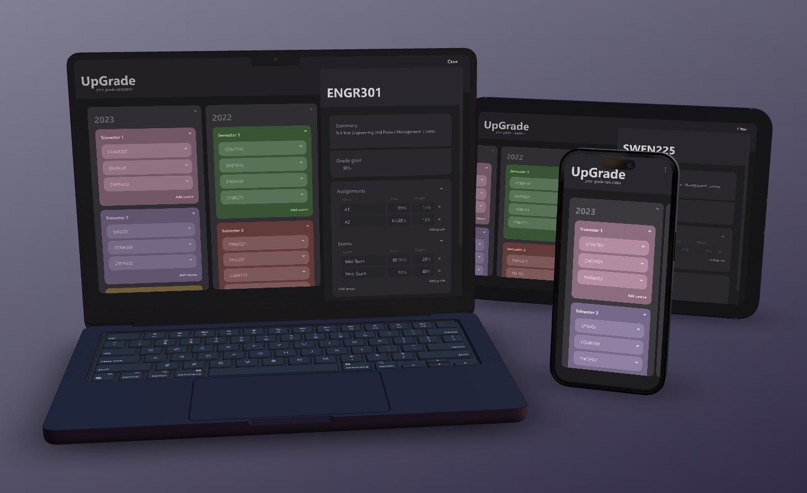

# UpGrade Grade Calculator
UpGrade is a intuitive grade calculator that can be installed on any of your devices. It stores your grades as you progress throughout uni, and provides estimates to make sure you can reach your goals!

## Features
UpGrade is built using React, to provide an efficient cross-platform app. No component libraries have been used here, and all the graphics have been created myself. It features a export and import JSON function so that you can back up your data or transfer it to another device!

What it provides unlike other apps will be being able to predict multiple grades at once to break down what you need to achieve your goal. It also stores it locally on your device for easy access at any time.

It has three main layouts for laptops, tablets and phones. For large devices, you get a split pane layout so that you can quickly switch between courses. For smaller devices, you get a blurred background with a floating course pane or full screen.

## Installation
On desktop Chromium browsers and Android, you can install UpGrade as a PWA by clicking the install button in the address bar. On other browsers, you can install UpGrade by going to the settings menu and clicking install.

On iOS, you will need to click share on Safari and then click add to home screen.

Device Mockup created from <a href="https://deviceframes.com/templates/macbook-pro-m1-14">MacBook Pro mockups</a>
